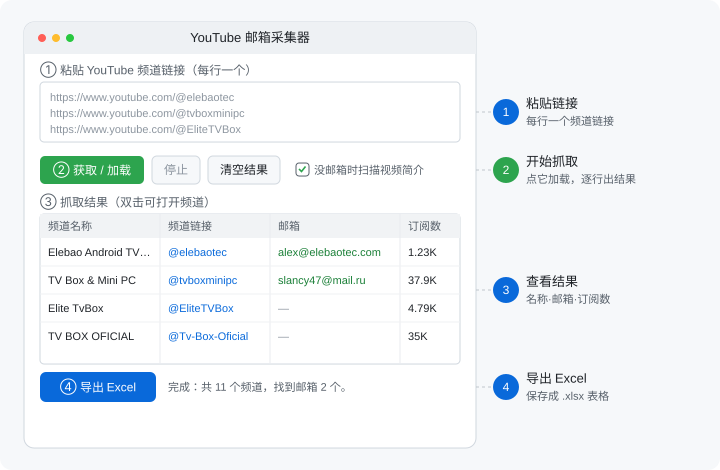
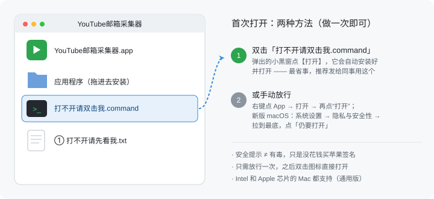

# YouTube 邮箱采集器

一个 **macOS / Windows 通用**的小工具：粘贴一个或一批 YouTube 频道链接，点一下，自动抓取每个频道的 **频道名称、频道链接、公开邮箱、订阅数**，最后一键导出成 **Excel 表格**。

提供图形界面（双击即用）和命令行两种用法。

> ⚠️ 只采集创作者**主动公开**的邮箱（写在频道简介 / 视频简介里的）。不会、也不能绕过 YouTube 那个需要点按钮+验证码才显示的“商务邮箱”。请在合法合规、符合 YouTube 服务条款的前提下使用。

---

## 目录

- [它能做什么](#它能做什么)
- [快速开始（三种方式）](#快速开始三种方式)
- [图形界面使用说明（macOS / Windows）](#图形界面使用说明macos--windows)
- [导出的 Excel 长什么样](#导出的-excel-长什么样)
- [支持的链接格式](#支持的链接格式)
- [能抓到 / 抓不到什么（重要）](#能抓到--抓不到什么重要)
- [命令行用法](#命令行用法)
- [自己打包成 exe / app](#自己打包成-exe--app)
- [常见问题 FAQ](#常见问题-faq)
- [项目文件说明](#项目文件说明)
- [免责声明](#免责声明)

---

## 它能做什么

- ✅ 单个或**批量**输入频道链接（一行一个，想贴多少贴多少）
- ✅ 自动抓取：频道名称、频道链接、公开邮箱、订阅数
- ✅ 一键导出 **Excel（.xlsx）**
- ✅ 识别轻度伪装的邮箱（如 `name (at) gmail (dot) com`）
- ✅ 自动去重、过滤无效邮箱
- ✅ 可选：About 页没邮箱时，自动翻最近视频简介找邮箱
- ✅ macOS 和 Windows 都能用，打包后**免装 Python**

---

## 快速开始（三种方式）

### 方式一：直接用打包好的程序（最简单，免装 Python）⭐ 推荐

- **macOS**：打开 `dist/YouTube邮箱采集器.dmg`，把里面的 App 拖进「应用程序」，然后打开它。
- **Windows**：直接双击 `dist\YouTubeEmailScraper.exe`。

> 自己还没打包？看下面 [自己打包成 exe / app](#自己打包成-exe--app)。

### 方式二：双击启动脚本（电脑已装 Python）

- **macOS**：双击 `启动-mac.command`
- **Windows**：双击 `启动-windows.bat`

脚本会自动准备依赖并打开界面。

### 方式三：命令行（适合批量 / 自动化）

```bash
pip install -r requirements.txt
python youtube_email_scraper.py -u https://www.youtube.com/@TechOnEarth
```

详见 [命令行用法](#命令行用法)。

---

## 图形界面使用说明（macOS / Windows）

macOS 和 Windows 用的是**同一个图形界面**，长得一样、操作一样。整个程序就一个窗口，跟着 ①②③④ 走即可：



### 在 macOS 上打开界面

> 💡 **发给别人时最省事的办法**：让对方打开 dmg 后，直接双击里面的
> **`打不开请双击我.command`**，会自动安装好、解除拦截并打开，全程只需点一次【打开】。

1. 打开 `dist/YouTube邮箱采集器.dmg`，把里面的 App 图标拖进「应用程序」。
2. 到「应用程序」里**双击**打开它。
3. 首次打开若提示“无法验证开发者 / 已损坏 / 无法打开”（因为没做苹果签名）：
   用上面的 `打不开请双击我.command`，或**右键点 App → 「打开」→ 再点「打开」**；
   新版 macOS 则到 *系统设置 → 隐私与安全性* 点「仍要打开」。详见下方[常见问题](#常见问题-faq)的图解。
4. 没有打包好的 App？双击项目里的 `启动-mac.command` 也能直接打开界面（需电脑已装 Python）。

> 本 App 是**通用版**，Intel 和 Apple 芯片的 Mac 都能直接运行。

### 在 Windows 上打开界面

1. 双击 `dist\YouTubeEmailScraper.exe` 即可，**无需安装 Python**。
2. 若弹出蓝色 SmartScreen 提示（同样因为没做代码签名）：
   点 **「更多信息」→「仍要运行」**。
3. 没有打包好的 exe？双击项目里的 `启动-windows.bat` 也能直接打开界面（需电脑已装 Python）。

### 操作四步（两个系统完全一样）

1. **① 粘贴链接** —— 把频道链接贴进上方输入框，**每行一个**。
2. **② 获取 / 加载** —— 点这个按钮开始抓取，下方表格会逐行出现结果。
   - 抓取中可随时点 **停止**；点 **清空结果** 清空表格。
   - 想更全？勾上 **“没邮箱时扫描视频简介”**（会慢一些，会去翻最近视频的简介找邮箱）。
3. **③ 抓取结果** —— 表格显示每个频道的名称、链接、邮箱、订阅数、状态（成功 / 无邮箱 / 错误）。**双击某一行可直接打开该频道**。
4. **④ 导出 Excel** —— 抓完后点这个，选保存位置，生成 `.xlsx` 表格。

---

## 导出的 Excel 长什么样

一个工作表（名为「YouTube 邮箱」），表头如下：

| YouTube频道名称 | YouTube频道链接 | YouTuber邮箱 | 订阅数据 | 状态 |
|---|---|---|---|---|
| Elebao Android TV Box Mini PCs | https://www.youtube.com/@elebaotec | alex@elebaotec.com | 1.23K subscribers | 成功 |
| TV Box & Mini PC | https://www.youtube.com/@tvboxminipc | slancy47@mail.ru | 37.9K subscribers | 成功 |
| Elite TvBox | https://www.youtube.com/@EliteTVBox |  | 4.79K subscribers | 无邮箱 |

- 一个频道有多个邮箱时，用 `; ` 分隔放在同一格。
- **状态**：`成功`（找到邮箱）/ `无邮箱`（频道没公开邮箱）/ `错误`（链接打不开等）。

---

## 支持的链接格式

下面这些写法都认，会自动归一化：

```
https://www.youtube.com/@Handle
https://www.youtube.com/channel/UCxxxxxxxx
https://www.youtube.com/c/CustomName
https://www.youtube.com/user/LegacyName
@Handle
Handle
```

---

## 能抓到 / 抓不到什么（重要）

为避免误会，先说清楚边界：

| 邮箱所在位置 | 能否抓到 |
|---|---|
| 写在**频道简介**里的邮箱 | ✅ 能 |
| 写在**视频简介**里的邮箱（需勾选视频扫描） | ✅ 能 |
| About 页那个**“查看电子邮件地址”按钮**后、需要过**验证码**才显示的商务邮箱 | ❌ 不能（任何爬虫都得人工过验证码） |
| 频道根本没留公开邮箱 | ❌ 没有就是没有 |

所以**有些频道显示“无邮箱”是正常的**，不是工具坏了 —— 而是对方把邮箱藏在验证码后面，或压根没公开。大频道尤其常见。

---

## 命令行用法

```bash
# 单个频道
python youtube_email_scraper.py -u https://www.youtube.com/@TechOnEarth

# 多个频道
python youtube_email_scraper.py -u @TechOnEarth @MrBeast

# 从文件批量读取（一行一个，# 开头为注释），并存成 CSV
python youtube_email_scraper.py -f channels.txt -o results.csv

# About 页没邮箱时，扫描最近 15 个视频的简介，结果存 JSON
python youtube_email_scraper.py -f channels.txt --videos 15 -o results.json
```

参数：

| 参数 | 说明 |
|------|------|
| `-u, --url`    | 一个或多个频道链接 / 用户名 |
| `-f, --file`   | 从文件读取，一行一个 |
| `-o, --output` | 输出文件，后缀 `.csv` 或 `.json`（不写则只打印到屏幕） |
| `--videos N`   | About 页没邮箱时，扫描最近 N 个视频简介（默认 0 = 关闭） |
| `--delay S`    | 每个频道之间等待秒数（默认 1.5，调大更稳） |

> 命令行导出的是 CSV/JSON；图形界面才导出 Excel。

---

## 自己打包成 exe / app

用 [PyInstaller](https://pyinstaller.org/) 把程序打包成普通用户双击即用的可执行文件。
⚠️ **不能跨平台编译**：Windows 的 `.exe` 必须在 Windows 上打、macOS 的 `.app` 必须在 macOS 上打。

### macOS → `.app` + `.dmg`

```bash
bash build_macos.sh
```

产物（**通用版 universal2，Intel + Apple 芯片通吃**）：
- `dist/YouTube邮箱采集器.app` —— 拖进「应用程序」即可
- `dist/YouTube邮箱采集器.dmg` —— 发给别人的安装包

> 脚本会自动用苹果自带的 universal2 Python 打包，所以 Intel 和 Apple 芯片的 Mac 都能直接运行。

### Windows → `.exe`

在一台装了 [python.org](https://www.python.org/downloads/) 版 Python 的 Windows 电脑上双击：

```
build_windows.bat
```

产物：`dist\YouTubeEmailScraper.exe`（单文件，发给别人双击就能跑）。

### 没有 Windows 电脑？用云端构建（GitHub Actions）

仓库里带了构建配置 `ci/build.yml`。**先启用它**（GitHub 要求 workflow 文件放在固定目录）：

```bash
mkdir -p .github/workflows && git mv ci/build.yml .github/workflows/build.yml
git commit -m "enable CI" && git push
```

> 用网页推送时，把 `ci/build.yml` 的内容新建到 `.github/workflows/build.yml` 即可；
> 命令行推送需要 token 带 `workflow` 权限（`gh auth refresh -h github.com -s workflow`）。

启用后：

1. 进 **Actions** 页，手动运行 *Build apps*（或打个 `v1.0.0` 之类的 tag）；
2. 它会**同时**在 Windows 和 macOS 机器上构建（macOS 跑的是自带 Tk 8.6 的 Python，产物可正常运行）；
3. 在该次运行的 **Artifacts** 里下载 `.exe` 和 `.dmg`。

这样不用自己有 Windows 机器也能拿到 Windows 安装包。

---

## 常见问题 FAQ

**Q：点了「获取 / 加载」没任何反应？**
A：基本是打开了**旧版本**程序。请删掉旧的，重新用 `dist/` 里**最新打包**的 App / exe（或用启动脚本从源码运行）。

**Q：对方 Mac 弹「应用程序"YouTube 邮箱采集器"无法打开。」（只有一个"好"按钮）？**
A：这通常是**芯片架构不匹配** —— 早期的包只支持 Apple 芯片，在 **Intel Mac** 上无法运行。
**现在的版本已改成「通用版（universal2）」，Intel 和 Apple 芯片都能跑。** 请用最新打包的
`dist/YouTube邮箱采集器.dmg` 重新发给对方即可。
> 怎么确认是不是通用版：终端运行 `lipo -archs "/路径/YouTube邮箱采集器.app/Contents/MacOS/YouTubeEmailScraper"`，
> 显示 `x86_64 arm64` 就是通用版。

**Q：macOS 提示「无法验证开发者 / 已损坏 / 来自互联网」，打不开？**
A：因为没做苹果签名 + 文件是从网络（微信/飞书/邮件）下载来的，被系统拦了。dmg 里已经
放好了帮你一键解决的小工具，任选一种：



1. **最省事**：双击 dmg 里的 **`打不开请双击我.command`** → 弹出的小黑窗点【打开】→
   它会自动把 App 装好、解除拦截并打开。以后双击图标直接开。
2. 或**右键点 App 图标 → 选「打开」→ 再点「打开」**；
3. 或到 *系统设置 → 隐私与安全性*，最下面点「仍要打开」（macOS 15 走这个）；
4. 命令行党：`xattr -cr "/Applications/YouTube邮箱采集器.app"` 清掉下载标记后双击即可。

**Q：Windows 弹出蓝色 SmartScreen 警告？**
A：同理，未做代码签名。点 **“更多信息” → “仍要运行”** 即可。

**Q：某些频道显示“无邮箱”？**
A：见 [能抓到 / 抓不到什么](#能抓到--抓不到什么重要)。多半是邮箱被验证码挡住、或对方没公开。可勾选「扫描视频简介」再试一次。

**Q：抓得慢 / 怕被限流？**
A：批量很多时，把命令行 `--delay` 调大（如 3 秒），或分批跑。

**Q：mac 打的 App 能在 Intel 老 Mac 上用吗？**
A：能。`build_macos.sh` 用苹果自带的 universal2 Python 打包，产出**通用版**（`x86_64 arm64`），
Intel 和 Apple 芯片通吃。无需为两种芯片各打一次。

---

## 项目文件说明

```
youtube-email-scraper/
├── youtube_email_gui.py        图形界面（主程序）
├── youtube_email_scraper.py    抓取引擎 + 命令行
├── requirements.txt            依赖（requests、openpyxl）
├── youtube_email_gui.spec      PyInstaller 打包配置
├── build_macos.sh              macOS 一键打包 .app + .dmg
├── build_windows.bat           Windows 一键打包 .exe
├── 启动-mac.command            macOS 双击从源码启动
├── 启动-windows.bat            Windows 双击从源码启动
├── channels.txt                批量输入示例
├── dist-extras/                随 dmg 一起打包的"一键解除拦截"小工具 + 说明
├── docs/interface.svg          界面图解
├── docs/first-open-guide.svg   首次打开指引（发给别人时附上）
├── ci/build.yml                云端同时构建 win + mac（启用见上文，移到 .github/workflows/）
└── dist/                       打包产物（.app / .dmg / .exe）
```

---

## 免责声明

本工具仅用于采集创作者**已公开**的联系方式，常见于商务合作、市场调研等正当用途。使用者需自行确保符合 **YouTube 服务条款**、当地法律及 **GDPR / 个人信息保护**等相关规定，并对采集到的数据用途负责。请勿用于骚扰、垃圾邮件或任何非法目的。
